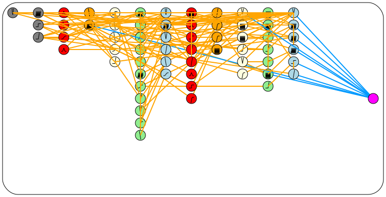

## wann

  

Weight Agnostic Neural Networks, implemented in Go.

Inspired by: https://ai.googleblog.com/2019/08/exploring-weight-agnostic-neural.html

This is a work in progress. The current state is that working neural networks can be generated, but that they are not as simple as they could be, and that the diagram drawing functionality produces images with a bit much happening. Like this one:

Here's a more tidy SVG image, also created by this package:

